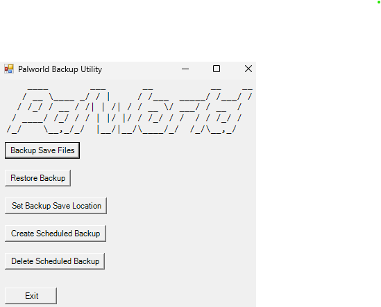

# Palworld Backup Utility

This script is a utility for backing up and restoring the save files of **Palworld**. It also allows users to schedule automatic backups and manage backup locations. This tool is ideal for those who want to automate their save file backups and ensure they can restore their progress if needed.


## Features
- **Backup Save Files**: Creates a zip backup of your save files.
- **Restore Backup**: Restores a previously created backup.
- **Set Backup Save Location**: Allows users to set a custom folder for storing backup files.
- **Create Scheduled Backup**: Schedules automatic daily backups at a specified time.
- **Delete Scheduled Backup**: Removes the scheduled backup task.

## Requirements
- **Windows**: The script is designed to work on Windows systems.
- **PowerShell**: PowerShell should be available on your system (Windows PowerShell 5.1 or newer).
- **.NET Framework**: The script uses Windows Forms, so ensure you have the .NET Framework installed.

## Installation

1. **Download the file "PalworldBackupUtility.ps1 or Clone the repository**:


   ```bash
   git clone https://github.com/ahiser24/palworld-backup-utility.git
   cd palworld-backup-utility
## How to Use
- **Backup Save Files**
Click the Backup Save Files button to create a zip file of your Palworld save files.
The script will create the backup in the location you set, or prompt you to set a new location if it's not yet configured.
- **Restore Backup**
Click the Restore Backup button to restore a previously created backup.
You will be prompted to choose a zip file from your backup folder.
- **Set Backup Save Location**
Click the Set Backup Save Location button to choose a custom folder where the backups will be stored.
The selected path will be saved for future use.
- **Create Scheduled Backup**
Click the Create Scheduled Backup button to set up a daily automated backup at your preferred time.
The script will ask for the time in HH:mm format (e.g., 09:00 for 9 AM).
- **Delete Scheduled Backup**
Click the Delete Scheduled Backup button to remove the scheduled task for daily backups.
- **Exit**
Click the Exit button to close the application.


## How It Works
- **Backup-SaveFiles:** This function compresses your Palworld save files into a zip archive. You can choose the destination folder for the backup.
- **Restore-Backup:** This function restores the selected backup zip file back to the original save directory.
- **Create-ScheduledBackup:** This function allows you to automate backups by creating a daily scheduled task in Windows Task Scheduler. You can specify the time for the backup.
- **Delete-ScheduledBackup:** This function removes the scheduled task for backups.


## Troubleshooting
Invalid Time Format Error: Ensure that the time entered for the scheduled backup is in the correct HH:mm format.
Access Denied: Make sure you have permission to run PowerShell scripts and write to the specified backup location.

Contributing
If you'd like to contribute to this project, feel free to fork the repository and submit a pull request. If you encounter any issues, please report them via GitHub Issues.
